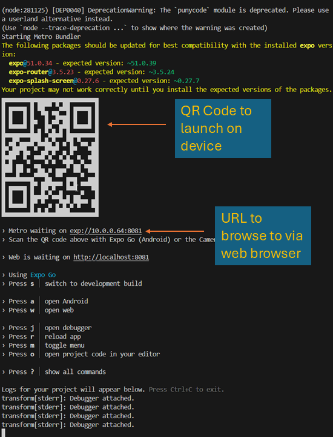

# wvu-seng564-individual-program
My Home Target - a mobile app to drive engagement between realtors and their clients through rank ordering home attributes.

## Environment Prerequisites

1. The latest LTS version of Node.js installed ([installation instructions](https://nodejs.org/en/learn/getting-started/how-to-install-nodejs))
2. The PNPM package manager ([installation instructions](https://pnpm.io/installation))


## Installation

1. Clone this repository  
    ```bash
    $ git clone git@github.com:aaronibrahim/wvu-seng564-individual-program.git
    ```
2. From the project root, navigate to the `home-target` directory
    ```bash
    $ cd home-target
    ```
3. Install node dependencies using the pnpm package manager
    ```bash
    $ pnpm install
    ```
## Running The application
1. Start the application
    ```bash
    $ pnpm start
    ```
2. The application can be run via a web browser displayed in the terminal output, or on device by scanning the QR code. See image below for guidance:  
  
